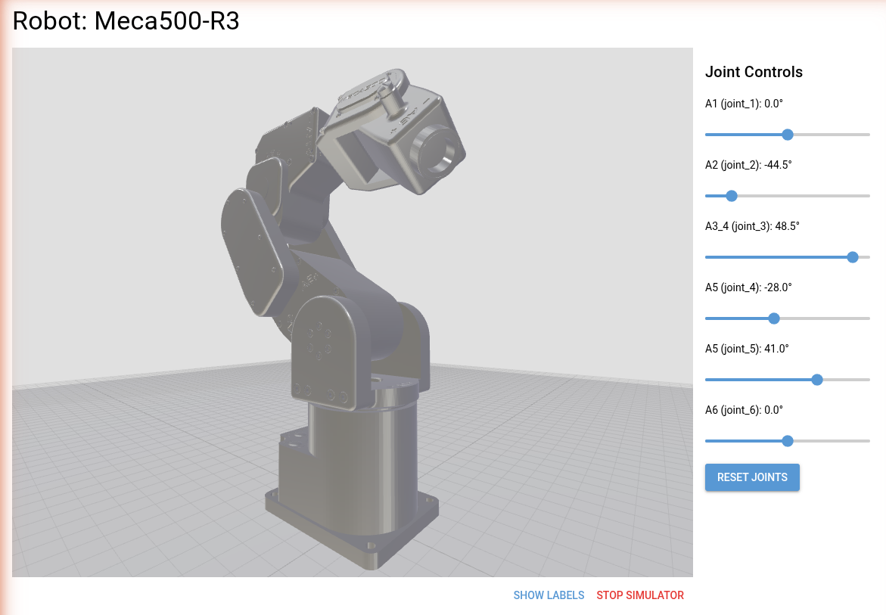

[](https://github.com/gilesknap/robot-arm-sim/actions/workflows/ci.yml)
[](https://codecov.io/gh/gilesknap/robot-arm-sim)

[](https://www.apache.org/licenses/LICENSE-2.0)

# robot-arm-sim

Analyze robot arm STL meshes, generate URDF models, and simulate them interactively in the browser.

Source          | <https://github.com/gilesknap/robot-arm-sim>
:---:           | :---:
Docker          | `docker run ghcr.io/gilesknap/robot-arm-sim:latest`
Documentation   | <https://gilesknap.github.io/robot-arm-sim>
Releases        | <https://github.com/gilesknap/robot-arm-sim/releases>

## Pipeline

```
STL files → analyze → chain.yaml → generate → URDF → simulate
```

## Quick start

```bash
git clone https://github.com/gilesknap/robot-arm-sim.git
cd robot-arm-sim
uv sync
uv run robot-arm-sim simulate robots/Meca500-R3/
```

Opens a browser at `http://localhost:8080` with a 3D model and joint sliders.

## CLI

```
robot-arm-sim analyze  <robot_dir>                    # Analyze STL meshes
robot-arm-sim generate <robot_dir> <chain.yaml>       # Generate URDF
robot-arm-sim simulate <robot_dir> [--port 8080]      # Launch simulator
```


<!-- README only content. Anything below this line won't be included in index.md -->



See <https://gilesknap.github.io/robot-arm-sim> for full documentation.
