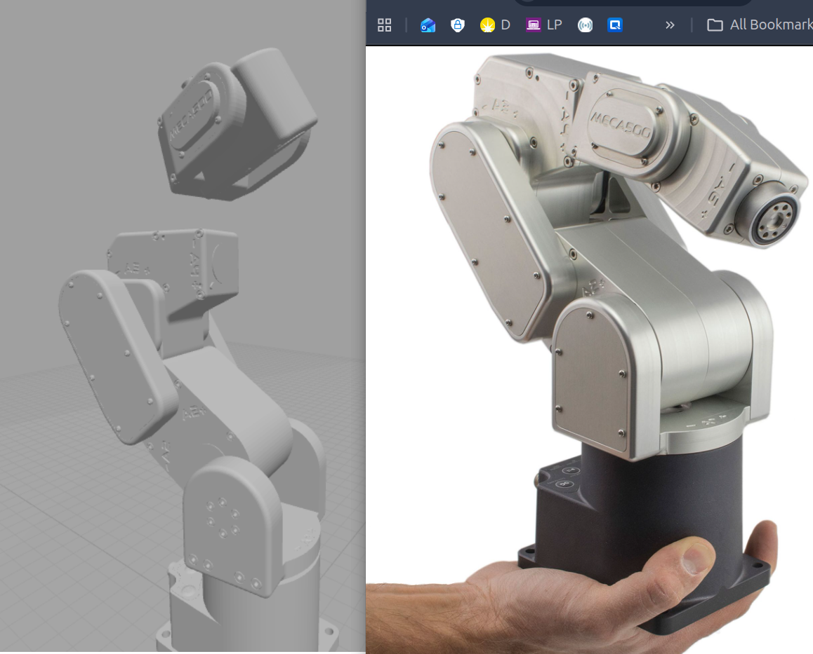

# Robot Arm Sim — Design Conversation

This project was generated by Claude Code using stl files and web lookup.

The prompting that led to the current state of the project is documented below, along with a precis of the responses. The original plan for implementation is in [plan.md](plan.md).

## Prompt 1: STL Loading
**User:** what is the best way for you to load stl files into context and understand the shapes they describe

**Claude:** ASCII STL can be read directly as text. For binary STL (which is more common), the best approach is to parse with `trimesh` to extract geometry properties (bounding box, dimensions, volume, center of mass) and render multi-angle views to PNG for visual inspection. Recommended: render to PNG + extract summary stats.

## Prompt 2: Deep Analysis
**User:** I want you to be able to do a deep analysis of the models and infer how the parts fit together. Do you think you are up to that?

**Claude:** Yes — by parsing geometry, rendering multi-angle views, identifying geometric features (cylindrical surfaces for joints, flat mating faces, holes/shafts), and analyzing adjacency between sequentially-named parts to infer the assembly relationships.

## Prompt 3: Project Architecture
**User:** OK we have a python project here. I'd like to change argparse to typer and have some sub commands. The firs subcommand is to parse binary stl files (but leave open the possibilty of other formats). This parsing should create an output that is fully understandable to claude.

**Claude:** Agreed — Typer CLI with an `analyze` subcommand that produces a claude-readable text cache of the geometry, so future conversations can reason about the parts without re-parsing binary files.

## Prompt 4: Claude Skill for Assembly Reasoning
**User:** So now I want to write a claude skill that uses the above to reason about the parts it can see. I want the skill to infer how the parts fit together and where the pivot points are (to make a robot arm - this will always be the target, although we will want to add other robot descriptions later)

**Claude:** The skill would be a "robotics reasoning mode" — load the text analysis, infer mating faces, joint axes, pivot points, and kinematic chain. Robot arm is the primary use case but architecture supports other robot types.

## Prompt 5: Robot Description Output
**User:** Next I want that skill to output a robot description that can be fed into a python based simulator. You mentioned a format for that earlier - is there a standard format that this could use?

**Claude:** URDF (Unified Robot Description Format) — XML-based, describes links, joints, kinematic chains. It's the industry standard supported by PyBullet, MuJoCo, Drake, ROS, and lightweight Python parsers. The skill would output URDF.

## Prompt 6: Simulator with 3D Rendering
**User:** nice. lets write the intermediate files down in the robot folder. Then lets have an additional entrypoint into the python project 'simulate'. This will faithfully render the robot in 3d - with the render including the details from the original stl files. The GUI will also supply sliders that can rotate each of the joints of the robot so that the simulation is animated accordingly.

**Claude:** Full pipeline: `analyze` → claude skill → URDF → `simulate`. The robot folder holds everything: source STLs, analysis output, and generated URDF.

## Prompt 7: GUI Framework
**User:** OK I'm not aware of those so would need to take your steer. I'd quite like to use nicegui for the overall GUI so that we can make it beautiful and work in a browser. Do any of those libraries fit well into that framework?

**Claude:** Excellent fit — NiceGUI's `ui.scene` uses Three.js which loads STL natively, sliders are trivial, runs in browser, looks modern out of the box. No need for heavy native 3D libraries. Just `trimesh` for analysis and `nicegui` for the simulator.

## Prompt 8: Additional Features
**User:** can you think of anything else that would make this project awesome, or improve on any of the choices above?

**Claude:** Proposed additions:
- Coordinate frame visualization (toggle joint axes overlay)
- Joint limits on sliders with color feedback
- YAML for analysis output format
- Preset camera views (front/side/top/iso)
- Inverse kinematics (click-to-reach using `ikpy`)
- Collision highlighting (parts turn red on intersect)
- Trajectory recording/playback
- Clean pipeline separation: each stage independently re-runnable

## Prompt 9: Pipeline Confirmation
**User:** That all sounds very nice - I definitely intended for the URDF bit to happen outside of sim.

**Claude:** Confirmed pipeline: `analyze → [claude skill] → URDF → simulate`. Each step reads/writes to the robot folder, each independently re-runnable.

## Prompt 10: Documentation and Plan
**User:** one more thing. I'm hoping that this would be a nice demo of how to set up a project with claude (assuming it works!). Write a document /prompt.md before you start that lists the prompts above, plus a precis of your responses. And write the plan you are about to make into /plan.md. One final thing - you can use as much effort as needed to do a good job, make it multi agent if that helps.

**Claude:** Created prompt.md (this file) and plan.md with full implementation plan. Will use multi-agent where it helps.

## Prompt 11: Skill Enhancement
**User:** lets add to the skill that it can search for manufacturers info online if the stl files are not enough to complete the task.

**Claude:** Added to the skill: if analysis data is insufficient (joint limits unclear, dimensions ambiguous), the skill will use WebSearch to find manufacturer specs, datasheets, and manuals to fill gaps and cross-validate the geometric analysis.

## Prompt 12: Dependency Management
**User:** please use uv - there is already a venv and add all dependencies into pyproject.toml

**Claude:** Noted — uv throughout, all deps in pyproject.toml, install with `uv sync`.

# Later ...

## Prompt 13: URDF Validation and Refinement

**User:** we need to have another go at the urdf. See comparison between the sim using the urdf and a real image of the robot in a similar pose. There are still multiple issues. Can you think of a way to improve the assembly-reasoning skill to get perfect results.

**Claude:** Approach: (1) capture reference images from the real robot in known poses, (2) render the URDF simulation in identical poses, (3) visually compare side-by-side to identify joint misalignments and disconnections, (4) refine the assembly-reasoning skill to validate joint axes against geometry and cross-check with manufacturer datasheets, (5) iterate until sim matches reality.

The plan for this is [plan2.md](plan2.md).

## Prompt 14: Implement Connection Point Detection Plan

**User:** Implement the following plan: Fix URDF Assembly via Programmatic Connection Point Detection. [Full plan in plan2.md — split mesh analysis from kinematic reasoning, detect bore/shaft centers programmatically, generate URDF from chain.yaml spec.]

**Claude:** Implemented all 7 steps on branch `feature/connection-point-detection`:
- Added `ConnectionPoint` dataclass and detection module (`connections.py`) that slices cross-sections along cylindrical axes and fits circles to find bore centers
- Created `urdf_generator.py` that reads a `chain.yaml` kinematic chain spec + analysis connection points to compute exact joint/visual transforms
- Added `generate` CLI subcommand: `robot-arm-sim generate <robot_dir> <chain.yaml>`
- Updated assembly-reasoning skill to write `chain.yaml` instead of raw URDF
- Enhanced `verify_kinematics.py` with `--json` output and corrected expected positions
- Created `chain.yaml` for Meca500-R3 — all 6 joints validate at 0mm error against DH-derived positions
- Pipeline: `analyze → connection_points → skill writes chain.yaml → generate → URDF → simulate`

## Prompt 15: Update README

**User:** Update the readme.md to describe this project and give details of how to start the simulator and how to add a new robot.

**Claude:** Rewrote README.md with: pipeline overview diagram, installation instructions, quick start with the Meca500-R3, step-by-step guide for adding a new robot (prepare STLs → analyze → write chain.yaml → generate URDF → verify → simulate), CLI reference, explanation of how connection point detection works, and project structure tree.

## Prompt 16: Visual URDF Tuning Skill

**User:** The URDF is still not quite right — still has a few issues with joint location and orientation. You mentioned a plan to pose the simulator and compare with images online. Can you prepare a new skill to do that and refine the URDF.

**Claude:** Created `.claude/skills/visual-urdf-tuning.md` — a skill that guides the full visual comparison loop:
1. Search for reference photos of the real robot at known poses
2. Launch simulator, capture screenshots at zero config + diagnostic poses (J2=45°, J3=-45°, etc.)
3. Compare against reference images, diagnose issues using a symptom→cause→fix table (floating mesh → visual_xyz, wrong rotation → visual_rpy, wrong pivot → joint origin override, etc.)
4. Edit chain.yaml, regenerate URDF, verify kinematics, restart simulator
5. Iterate until sim matches reality, working base-outward

Uses browser automation (claude-in-chrome) to interact with the simulator and capture screenshots.
